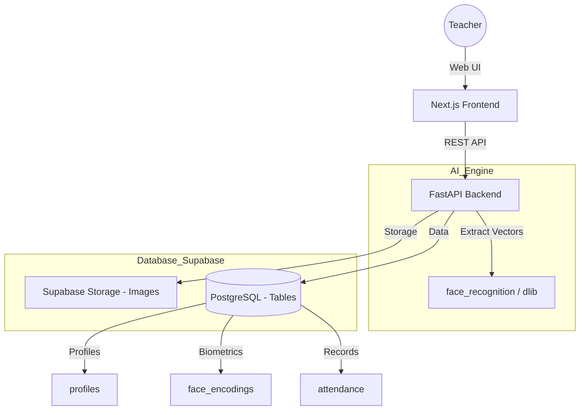

# 📊 SmartFaceAttendance: Full System Workflow & Data Map

This document explains exactly what happens when you use the application, where your data goes, and how it is processed.

---

## 🚀 1. User (Faculty) Experience
The application is divided into **three core lifecycles**: Registration, Student Enrollment, and Attendance Marking.

### A. Teacher Signup & Login
*   **What happens?** You fill the Signup form with your Department and Employee ID.
*   **Data Source**: Frontend `SignupPage.tsx`.
*   **Processing**: `auth_utils.py` creates a user in Supabase Auth.
*   **Storage**: 
    *   `auth.users`: (Internal Supabase) Stores your email/password.
    *   `public.profiles`: Stores your Name, Role (Teacher/Admin), and Department.

### B. Student Enrollment (Registration)
*   **What happens?** You add a student's name and roll number.
*   **Data Source**: `AddStudentPage.tsx`.
*   **Processing**: `simple_api_server.py` checks if the Batch exists. If not, it creates a new record in `batches`.
*   **Storage**: 
    *   `public.batches`: Stores the Batch Name (e.g., 2023-2027).
    *   `public.students`: Stores the Student Name, Roll No, and `batch_id`.

### C. Biometric Enrollment (Face Capture)
*   **What happens?** You capture 3-5 photos of the student.
*   **Processing**:
    1.  **Storage**: Photos are uploaded to Supabase Storage (Bucket: `students`).
    2.  **AI Extraction**: The `face_recognition` library extracts a 128-dimension "Face Vector" (numbers representing unique face features).
*   **Storage**: 
    *   `public.face_encodings`: Stores the student's face vector as a **JSONB** record. This is what the AI compares against during attendance.

### D. Marking Attendance (The "Magic" Moment)
*   **What happens?** A student stands before the camera.
*   **Processing**:
    1.  **Capture**: The camera sends a frame to the `/api/attendance/verify-image` endpoint.
    2.  **Match**: The AI compares this frame against all face vectors stored in the `face_encodings` table.
    3.  **Threshold**: If the "Similarity Score" is > 0.6 (Confidence), the student is recognized.
*   **Storage**: 
    *   `public.attendance`: Stores the final record (Student ID, Date, Status=Present, Method=Face).
    *   `public.recognition_logs`: Stores the history of the scan (Success/Failure, Confidence level).

---

## 📂 2. Database Table Map (Supabase)

| Table Name | Purpose | Key Data Stored |
| :--- | :--- | :--- |
| **`profiles`** | User Identity | Name, Role, Email, Employee ID |
| **`batches`** | Academic Groups | Batch Name (2024-2028), Dept |
| **`students`** | Student Registry | Name, Roll No, Batch ID |
| **`face_encodings`** | **AI Brain** | **Face Vectors (JSONB)**, Image Path |
| **`subjects`** | Curriculum | Subject Name (e.g., DSA, Python) |
| **`classes`** | Scheduling | Linking Teacher + Subject + Batch |
| **`attendance`** | Final Records | Student ID, Class ID, Date, Status |
| **`recognition_logs`** | History | Scan timestamp, Success/Failure |

---

## 🔄 3. System Architecture Diagram

---

## 🏆 4. Where is the "History" stored?
*   **Attendance History**: Found in the `attendance` table.
*   **Academic History**: Found in the `classes` and `subjects` tables.
*   **AI Scan History**: Found in the `recognition_logs` table.

*This map summarizes the full University-Grade flow of the SmartFaceAttendance system.* 🏛️🚀🎓
